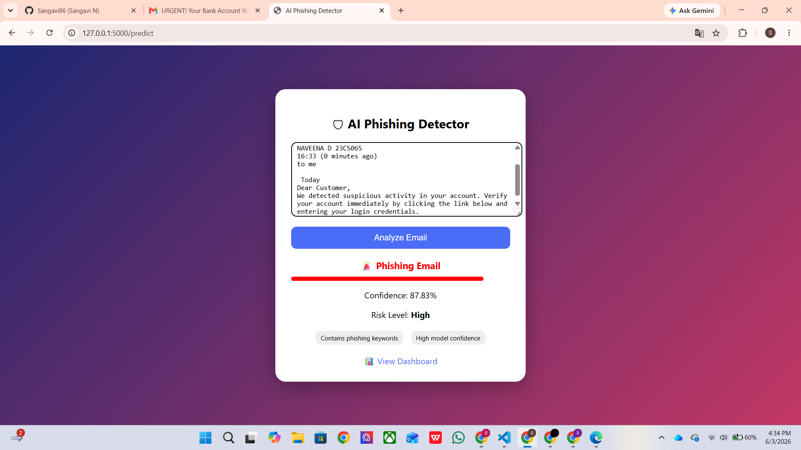
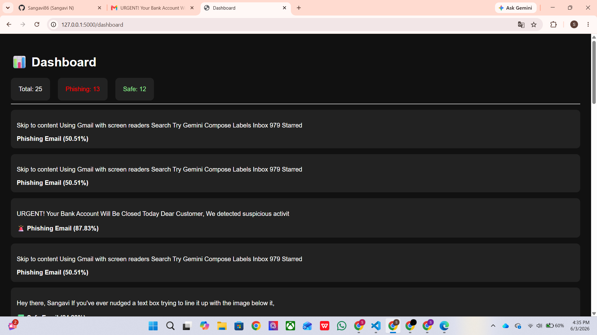
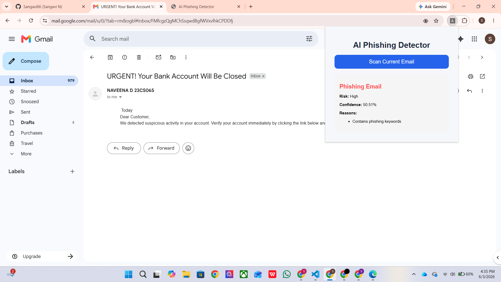

# 📸 Project Screenshots

## Gmail Email Scan



## Dashboard Analytics



## Chrome Extension



# 🛡️ AI Phishing Detector

AI Phishing Detector is a machine learning-based web application that helps identify phishing emails by analyzing their content and detecting suspicious patterns. The goal of this project is to improve email security by providing users with a simple way to check whether an email is safe or potentially malicious.

To make the system more user-friendly, I also developed a Chrome Extension that allows users to scan emails directly from Gmail without manually copying and pasting the email content.

---

## 📌 About the Project

Phishing emails are one of the most common cyberattacks used to steal sensitive information such as passwords, banking details, and personal data. This project uses Natural Language Processing (NLP) and Machine Learning techniques to classify emails as either **Safe** or **Phishing**.

The system analyzes email content, generates a confidence score, identifies suspicious indicators, and provides a risk assessment to help users make informed decisions.

---

## 🚀 Features

### Web Application

* Analyze email content by pasting it into the application
* Detect phishing and legitimate emails
* Display confidence score and risk level
* Explain why an email was flagged as suspicious

### Dashboard

* View total scanned emails
* Track phishing and safe email statistics
* Maintain scan history for analysis

### Machine Learning Model

* Email classification using NLP techniques
* Text vectorization and feature extraction
* Confidence-based prediction system

### Chrome Extension

* Scan emails directly from Gmail
* Automatically send email content to the Flask backend
* Display phishing analysis in real time
* Eliminates the need for manual copy-paste

---

## 🏗️ How It Works

```text
Email Content
      │
      ▼
Chrome Extension / Web App
      │
      ▼
Flask Backend API
      │
      ▼
Machine Learning Model
      │
      ▼
Prediction & Risk Analysis
      │
      ▼
Results Dashboard
```

---

## 🛠️ Technologies Used

### Backend

* Python
* Flask
* Flask-CORS

### Machine Learning

* Scikit-Learn
* Joblib
* Natural Language Processing (NLP)

### Frontend

* HTML
* CSS
* JavaScript

### Browser Extension

* Chrome Extension API

### Storage

* JSON-based scan history

---

## 📂 Project Structure

```text
AI-Phishing-Detector/
│
├── app/
├── model/
├── browser-extension/
├── train.py
├── requirements.txt
└── README.md
```

---

## ⚙️ Installation

### Clone the Repository

```bash
git clone https://github.com/Sangavi86/ai-phishing-detector.git
cd ai-phishing-detector
```

### Install Dependencies

```bash
pip install -r requirements.txt
```

### Run the Application

```bash
cd app
python app.py
```

The application will run at:

```text
http://127.0.0.1:5000
```

---

## 🧩 Chrome Extension Setup

1. Open Chrome and navigate to `chrome://extensions`
2. Enable **Developer Mode**
3. Click **Load Unpacked**
4. Select the `browser-extension` folder
5. Open Gmail
6. Click on the extension icon
7. Select **Scan Current Email**

---

## 📈 Sample Output

```text
Result: Phishing Email

Risk Level: High

Confidence Score: 91.4%

Reasons:
✓ Contains phishing keywords
✓ Contains suspicious links
✓ High model confidence
```

---

## 🎯 Applications

* Personal email security
* Cybersecurity awareness and education
* Email filtering systems
* Phishing attack detection
* Academic and research projects

---

## 🔮 Future Improvements

* Automatic email scanning when opening Gmail messages
* URL reputation and link analysis
* Sender reputation verification
* Threat score visualization
* Real-time warning banners inside Gmail
* Advanced analytics dashboard
* Cloud deployment

---

## 👨‍💻 Author

**Sangavi N**

Computer Science Engineering Student

This project was developed as part of my learning journey in Machine Learning, Cybersecurity, Web Development and Browser Extension Development.
